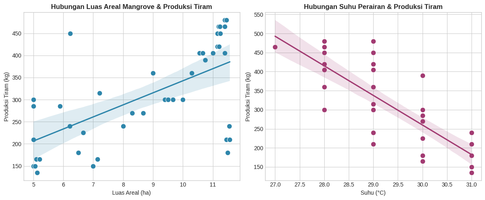

# Analisis Pengaruh Mangrove & Suhu terhadap Produksi Tiram
*Studi Kasus: Desa Tibang, Banda Aceh 2010-2022*

## Hasil Utama
Model regresi berganda menunjukkan **73.9% variasi produksi tiram** bisa dijelaskan oleh luas mangrove dan suhu perairan.

- **Luas mangrove**: Berpengaruh positif & signifikan (p < 0.001)
- **Suhu perairan**: Berpengaruh signifikan (p < 0.001), tapi hubungannya linear tapi hasil nya hanya optimal di rentang suhu tertentu

## Insight Bisnis
1. **Prioritaskan reboisasi mangrove**: Setiap kenaikan 1 ha mangrove berkorelasi dengan kenaikan produksi.
2. **Monitoring suhu panen**: Suhu optimal tiram ada di 27-30°C. Di luar itu, produksi turun/ daging tiram tidak banyak dihasilkan.

## Limitasi & Next Steps
Model linear belum menangkap efek "suhu optimal" 27-30°C. Sudah dicoba model kuadratik tapi fit-nya belum lebih baik karena data sebagian besar berada di rentang optimal.  
**Next**: Coba piecewise regression dengan binning suhu <27°C, 27-30°C, >30°C.

Detail metodologi, uji asumsi klasik, dan kode lengkap:  
👉 [Buka Notebook Colab](https://colab.research.google.com/drive/1bf0btvpzSInUl0zIcFrfer4BFq6bbJUC?usp=sharing)

## Cara Jalanin
1. Buka link Colab di atas
2. Run all cells  
   *Dataset sudah di-upload ke repo, jadi nggak perlu upload manual*

---
**Tech Stack**: Python, Pandas, Scikit-learn, Statsmodels, Matplotlib
